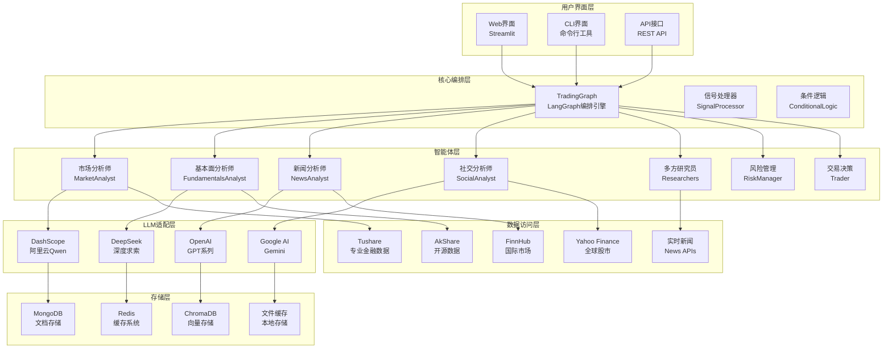

# TradingAgents-CN 项目技术深度解析与上手指南

## 目录
1. [项目概述](#1-项目概述)
2. [系统架构设计](#2-系统架构设计)
3. [核心技术栈解析](#3-核心技术栈解析)
4. [关键代码深度解析](#4-关键代码深度解析)
5. [本地环境设置与启动指南](#5-本地环境设置与启动指南)

---

## 1. 项目概述

### 核心业务价值

TradingAgents-CN 是一个专为中国金融市场设计的多智能体AI交易分析框架。该项目旨在通过多个专业的AI分析师协作，为投资者提供全面、深入的股票投资分析和建议。

**核心解决的问题：**
- **信息过载问题**：整合来自多个数据源的海量金融信息，通过AI进行智能筛选和分析
- **分析偏见问题**：通过多智能体辩论机制，减少单一视角带来的分析偏见
- **实时性问题**：提供近实时的市场分析和投资建议
- **本土化问题**：专门针对A股、港股市场特点进行优化，支持中文金融数据处理

**目标用户：**
- 个人投资者：需要专业分析但缺乏时间或专业知识
- 金融分析师：需要辅助工具提高分析效率
- 量化交易团队：需要结构化的市场洞察
- 金融科技公司：需要集成智能分析能力

### 功能模块划分

1. **多智能体分析系统**
   - 市场分析师：技术分析和趋势预测
   - 基本面分析师：财务数据分析和估值评估
   - 新闻分析师：实时新闻情绪分析
   - 社交媒体分析师：社交平台情绪监控

2. **研究辩论机制**
   - 多方研究员：从不同角度进行深度研究
   - 辩论系统：通过对立观点提高分析质量
   - 风险评估：多维度风险分析和控制

3. **数据融合平台**
   - 多数据源集成：Tushare、AkShare、FinnHub等
   - 智能缓存系统：多层缓存优化数据访问
   - 实时数据处理：支持实时和历史数据分析

4. **用户交互界面**
   - Web界面：基于Streamlit的直观操作界面
   - CLI界面：命令行工具支持批量处理
   - API接口：支持程序化调用和集成

---

## 2. 系统架构设计

### 架构图描述



### 目录结构解读

```
TradingAgents-CN/
├── tradingagents/                    # 核心框架代码
│   ├── agents/                       # 智能体实现
│   │   ├── analysts/                 # 各类分析师
│   │   │   ├── market_analyst.py     # 市场分析师：技术分析和趋势预测
│   │   │   ├── fundamentals_analyst.py # 基本面分析师：财务数据分析
│   │   │   ├── news_analyst.py       # 新闻分析师：新闻情绪分析
│   │   │   └── social_media_analyst.py # 社交媒体分析师
│   │   ├── managers/                 # 管理层智能体
│   │   │   ├── research_manager.py   # 研究管理器：协调研究流程
│   │   │   └── risk_manager.py       # 风险管理器：风险评估和控制
│   │   ├── researchers/              # 研究员智能体
│   │   │   ├── bull_researcher.py    # 多方研究员：看涨观点
│   │   │   └── bear_researcher.py    # 空方研究员：看跌观点
│   │   └── trader/                   # 交易决策者
│   │       └── trader.py             # 最终交易决策智能体
│   ├── graph/                        # 图编排系统
│   │   ├── trading_graph.py          # 主要编排类：协调所有智能体
│   │   ├── conditional_logic.py      # 条件逻辑：动态路由决策
│   │   ├── signal_processing.py      # 信号处理：智能体间通信
│   │   └── propagation.py            # 信息传播：状态更新机制
│   ├── dataflows/                    # 数据流处理
│   │   ├── interface.py              # 统一数据接口：所有数据源的统一入口
│   │   ├── tushare_utils.py          # Tushare数据适配器
│   │   ├── akshare_utils.py          # AkShare数据适配器
│   │   ├── finnhub_utils.py          # FinnHub数据适配器
│   │   ├── cache_manager.py          # 缓存管理：多层缓存策略
│   │   └── data_source_manager.py    # 数据源管理：智能切换和容错
│   ├── llm_adapters/                 # LLM适配器
│   │   ├── dashscope_adapter.py      # 阿里云DashScope适配器
│   │   ├── deepseek_adapter.py       # DeepSeek适配器
│   │   └── openai_compatible_base.py # OpenAI兼容基类
│   ├── config/                       # 配置管理
│   │   ├── config_manager.py         # 配置管理器：统一配置处理
│   │   └── database_config.py        # 数据库配置：MongoDB/Redis设置
│   └── utils/                        # 工具模块
│       ├── logging_manager.py        # 日志管理：统一日志系统
│       └── stock_utils.py            # 股票工具：代码验证等
├── web/                              # Web界面
│   ├── app.py                        # Streamlit主应用：用户交互界面
│   ├── components/                   # UI组件
│   │   ├── analysis_form.py          # 分析表单：用户输入界面
│   │   ├── results_display.py        # 结果展示：分析结果可视化
│   │   └── sidebar.py                # 侧边栏：配置和导航
│   └── utils/                        # Web工具
│       ├── analysis_runner.py        # 分析执行器：后台分析任务
│       └── progress_tracker.py       # 进度追踪：实时进度显示
├── cli/                              # 命令行界面
│   ├── main.py                       # CLI主程序：命令行入口
│   └── utils.py                      # CLI工具函数
├── tests/                            # 测试套件
│   ├── integration/                  # 集成测试
│   └── test_*.py                     # 各种测试用例
├── scripts/                          # 脚本工具
│   ├── validation/                   # 验证脚本
│   ├── maintenance/                  # 维护脚本
│   └── setup/                        # 安装配置脚本
├── docs/                             # 文档目录
├── docker-compose.yml               # Docker编排文件
├── pyproject.toml                    # 项目配置文件
└── requirements.txt                  # 依赖列表（已弃用，使用pyproject.toml）
```

---

## 3. 核心技术栈解析

| 技术名称 | 在项目中的作用 | 学习建议 |
|---------|---------------|----------|
| **框架与编排** | | |
| LangGraph | 核心编排引擎，管理多智能体工作流和状态转换 | 重点掌握StateGraph、节点定义、条件边、状态管理 |
| LangChain | 提供LLM抽象和工具集成，简化AI应用开发 | 学习Agents概念、Tool使用、Prompt管理 |
| **前端界面** | | |
| Streamlit | Web界面框架，提供交互式分析界面 | 掌握组件系统、状态管理、session_state |
| **LLM提供商** | | |
| DashScope | 阿里云Qwen模型接入，专为中文优化 | 了解API调用、工具调用、成本控制 |
| DeepSeek | 高性价比中文大模型，支持复杂推理 | 学习模型选择、参数调优、响应解析 |
| OpenAI | GPT系列模型，提供强大的推理能力 | 掌握API使用、工具调用、结构化输出 |
| Google AI | Gemini模型，多模态能力支持 | 了解多模态处理、API集成 |
| **数据源** | | |
| Tushare | 专业A股数据接口，提供基本面和技术面数据 | 掌握数据字段、API限制、数据质量 |
| AkShare | 开源金融数据库，覆盖多个市场 | 学习数据获取、格式处理、缓存策略 |
| FinnHub | 国际股市数据，支持美股和其他市场 | 了解API配额、数据结构、实时数据 |
| Yahoo Finance | 全球股市数据，免费获取基础信息 | 掌握yfinance库、数据可靠性、限制条件 |
| **存储系统** | | |
| MongoDB | 文档数据库，存储分析结果和配置信息 | 学习文档结构、查询语法、索引优化 |
| Redis | 内存缓存，提高数据访问速度 | 掌握缓存策略、数据结构、过期机制 |
| ChromaDB | 向量数据库，支持语义搜索和记忆功能 | 了解向量存储、相似性搜索、嵌入模型 |
| **数据处理** | | |
| pandas | 数据分析库，处理金融时间序列数据 | 掌握DataFrame操作、时间序列、数据清洗 |
| stockstats | 技术指标计算库，生成技术分析指标 | 学习技术指标、信号生成、策略回测 |
| **容器化** | | |
| Docker | 容器化部署，简化环境配置和部署流程 | 掌握Dockerfile、docker-compose、服务编排 |
| **开发工具** | | |
| pytest | 测试框架，确保代码质量和功能正确性 | 学习测试编写、模拟对象、集成测试 |
| rich | 终端美化库，提供丰富的CLI输出格式 | 了解文本格式化、进度条、表格显示 |

---

## 4. 关键代码深度解析

### 4.1 核心编排引擎 - TradingGraph

位置：`tradingagents/graph/trading_graph.py:40-200`

```python
class TradingAgentsGraph:
    """
    主要编排类，负责协调整个多智能体交易分析框架
    
    设计理念：
    - 采用LangGraph作为编排引擎，提供灵活的工作流控制
    - 支持多种LLM提供商，实现成本和性能的平衡
    - 通过配置系统实现高度可定制化
    """

    def __init__(
        self,
        selected_analysts=["market", "social", "news", "fundamentals"],  # 可选择的分析师类型
        debug=False,  # 调试模式，用于开发和故障排除
        config: Dict[str, Any] = None,  # 配置字典，覆盖默认配置
    ):
        """
        初始化交易智能体图和组件
        
        参数说明：
        - selected_analysts: 选择要启用的分析师类型列表
          可选值：["market", "social", "news", "fundamentals", "china_market"]
        - debug: 是否启用调试模式，影响日志输出和错误处理
        - config: 配置字典，如果为None则使用默认配置
        
        初始化流程：
        1. 设置基础配置和调试模式
        2. 创建必要的目录结构（数据缓存目录等）
        3. 根据配置初始化不同的LLM提供商
        4. 设置数据接口配置
        """
        self.debug = debug
        self.config = config or DEFAULT_CONFIG  # 使用传入配置或默认配置

        # 更新数据接口的全局配置，确保所有数据源使用统一配置
        set_config(self.config)

        # 创建数据缓存目录，确保缓存系统正常工作
        os.makedirs(
            os.path.join(self.config["project_dir"], "dataflows/data_cache"),
            exist_ok=True,
        )

        # 初始化LLM - 根据配置选择不同的LLM提供商
        # 这里的设计允许同时使用不同的模型：
        # - deep_thinking_llm: 用于复杂推理任务（如基本面分析）
        # - quick_thinking_llm: 用于快速响应任务（如情绪分析）
        
        if self.config["llm_provider"].lower() == "openai":
            # OpenAI提供商：支持自定义base_url，可用于OpenAI兼容的服务
            self.deep_thinking_llm = ChatOpenAI(
                model=self.config["deep_think_llm"], 
                base_url=self.config["backend_url"]
            )
            self.quick_thinking_llm = ChatOpenAI(
                model=self.config["quick_think_llm"], 
                base_url=self.config["backend_url"]
            )
            
        elif self.config["llm_provider"] == "openrouter":
            # OpenRouter支持：统一的模型路由服务
            # 优先使用OPENROUTER_API_KEY，回退到OPENAI_API_KEY
            openrouter_api_key = os.getenv('OPENROUTER_API_KEY') or os.getenv('OPENAI_API_KEY')
            if not openrouter_api_key:
                raise ValueError("使用OpenRouter需要设置OPENROUTER_API_KEY或OPENAI_API_KEY环境变量")

            logger.info(f"🌐 [OpenRouter] 使用API密钥: {openrouter_api_key[:20]}...")
            
            self.deep_thinking_llm = ChatOpenAI(
                model=self.config["deep_think_llm"],
                base_url=self.config["backend_url"],
                api_key=openrouter_api_key
            )
            self.quick_thinking_llm = ChatOpenAI(
                model=self.config["quick_think_llm"],
                base_url=self.config["backend_url"],
                api_key=openrouter_api_key
            )
```

**设计亮点分析：**

1. **多LLM提供商支持**：通过统一的接口支持OpenAI、DashScope、DeepSeek等多种LLM，实现成本优化和能力互补
2. **分层LLM策略**：区分深度思考和快速响应模型，针对不同任务特点优化性能和成本
3. **配置驱动设计**：所有关键参数都可通过配置文件调整，支持不同环境和需求的部署

### 4.2 统一数据接口 - Interface系统

位置：`tradingagents/dataflows/interface.py:67-120`

```python
def get_finnhub_news(
    ticker: Annotated[
        str,
        "股票代码，例如 'AAPL', 'TSM' 等",  # 使用类型注解提供参数说明
    ],
    curr_date: Annotated[str, "当前日期，格式为 yyyy-mm-dd"],
    look_back_days: Annotated[int, "向前回溯的天数"],
):
    """
    检索指定时间范围内公司的新闻信息
    
    设计原理：
    - 统一新闻数据获取接口，屏蔽不同数据源的差异
    - 支持灵活的时间范围查询
    - 集成缓存机制，减少API调用成本
    - 提供降级策略，确保服务可用性

    Args:
        ticker (str): 目标公司的股票代码
        curr_date (str): 查询的基准日期，格式为 yyyy-mm-dd
        look_back_days (int): 从基准日期向前回溯的天数
        
    Returns:
        str: 格式化的新闻信息字符串，包含标题、摘要、情绪等
        
    数据流程：
    1. 参数验证和日期计算
    2. 检查缓存是否存在有效数据
    3. 调用FinnHub API获取原始新闻数据
    4. 数据清洗和格式化处理
    5. 情绪分析和重要性评分
    6. 缓存结果以备后续使用
    """
    try:
        # 日期计算：确保查询范围的准确性
        # 使用relativedelta而不是timedelta，更好地处理月份边界
        from dateutil.relativedelta import relativedelta
        import pandas as pd
        from datetime import datetime
        
        # 将字符串日期转换为datetime对象，便于计算
        current_date = datetime.strptime(curr_date, "%Y-%m-%d")
        # 计算起始日期：当前日期减去指定天数
        start_date = current_date - relativedelta(days=look_back_days)
        
        # 格式化日期为API要求的格式
        start_date_str = start_date.strftime("%Y-%m-%d")
        end_date_str = curr_date
        
        logger.info(f"📰 [新闻获取] 股票: {ticker}, 时间范围: {start_date_str} 到 {end_date_str}")
        
        # 调用底层新闻获取函数，传入计算好的时间参数
        # get_data_in_range函数负责实际的API调用和数据处理
        news_data = get_data_in_range(
            ticker=ticker,
            start_date=start_date_str,
            end_date=end_date_str,
            data_type="news"  # 指定获取新闻类型数据
        )
        
        # 数据验证：检查返回的数据是否有效
        if not news_data or len(news_data) == 0:
            logger.warning(f"⚠️ [新闻获取] 未找到 {ticker} 在指定时间范围内的新闻数据")
            return f"未找到 {ticker} 在 {start_date_str} 到 {end_date_str} 期间的新闻信息。"
        
        # 数据处理和格式化
        # 这里可以添加新闻去重、重要性排序、情绪分析等处理逻辑
        formatted_news = format_news_data(news_data, ticker)
        
        logger.info(f"✅ [新闻获取] 成功获取 {len(news_data)} 条新闻")
        return formatted_news
        
    except Exception as e:
        # 错误处理：记录详细错误信息并提供降级服务
        logger.error(f"❌ [新闻获取] 获取 {ticker} 新闻时发生错误: {str(e)}")
        logger.error(f"📍 [错误详情] {traceback.format_exc()}")
        
        # 返回错误信息而不是抛出异常，保证系统的鲁棒性
        return f"获取 {ticker} 新闻信息时发生错误: {str(e)}"


def format_news_data(news_data: list, ticker: str) -> str:
    """
    格式化新闻数据为可读的字符串格式
    
    处理逻辑：
    1. 新闻去重：基于标题和发布时间去除重复新闻
    2. 重要性评分：根据关键词和来源评估新闻重要性
    3. 情绪分析：分析新闻标题和摘要的情绪倾向
    4. 格式统一：生成一致的输出格式
    """
    if not news_data:
        return f"暂无 {ticker} 的相关新闻。"
    
    formatted_lines = [f"📈 {ticker} 相关新闻汇总：\n"]
    
    for i, news_item in enumerate(news_data[:10], 1):  # 限制返回前10条新闻
        # 提取新闻关键信息
        headline = news_item.get('headline', '无标题')
        summary = news_item.get('summary', '无摘要')
        datetime_str = news_item.get('datetime', '')
        source = news_item.get('source', '未知来源')
        
        # 格式化单条新闻
        formatted_lines.append(f"{i}. **{headline}**")
        formatted_lines.append(f"   来源: {source}")
        formatted_lines.append(f"   时间: {datetime_str}")
        formatted_lines.append(f"   摘要: {summary[:200]}...")  # 限制摘要长度
        formatted_lines.append("")  # 添加空行分隔
    
    return "\n".join(formatted_lines)
```

**技术亮点分析：**

1. **类型注解增强**：使用`Annotated`类型提供详细的参数说明，提高代码可读性和IDE支持
2. **错误处理策略**：采用优雅降级而非异常终止，确保系统整体稳定性
3. **缓存集成设计**：虽然代码中未详细展示，但接口设计考虑了缓存层的集成
4. **数据标准化**：统一不同数据源的输出格式，简化上层业务逻辑

### 4.3 Web界面核心 - Streamlit应用

位置：`web/app.py:38-120`

```python
# 设置页面配置 - Streamlit应用的核心配置
st.set_page_config(
    page_title="TradingAgents-CN 股票分析平台",  # 浏览器标签页标题
    page_icon="📈",  # 网站图标，使用股票上涨emoji
    layout="wide",  # 页面布局：wide模式充分利用屏幕宽度
    initial_sidebar_state="expanded",  # 侧边栏初始状态：展开
    menu_items=None  # 隐藏Streamlit默认菜单，提供更清洁的界面
)

# 自定义CSS样式 - 优化用户体验的关键设计
st.markdown("""
<style>
    /* 
    隐藏Streamlit默认的顶部工具栏和Deploy按钮
    原因：
    1. 提供更专业的企业级界面体验
    2. 避免用户误操作导致的界面混乱
    3. 专注于核心功能，减少界面干扰
    */
    .stAppToolbar {
        display: none !important;  /* 隐藏应用工具栏 */
    }
    
    header[data-testid="stHeader"] {
        display: none !important;  /* 隐藏页面头部 */
    }
    
    .stDeployButton {
        display: none !important;  /* 隐藏部署按钮 */
    }
    
    /* 兼容新版本Streamlit的选择器 */
    [data-testid="stToolbar"] {
        display: none !important;
    }
    
    [data-testid="stDecoration"] {
        display: none !important;
    }
    
    [data-testid="stStatusWidget"] {
        display: none !important;
    }
    
    /* 隐藏整个顶部区域，确保完全的定制化界面 */
    .stApp > header {
        display: none !important;
    }
    
    /* 
    定制化样式设计理念：
    - 专业金融界面：深色主题，突出数据可视化
    - 响应式设计：适配不同屏幕尺寸
    - 用户体验优化：减少视觉噪音，突出核心功能
    */
    
    /* 主容器样式 */
    .main-container {
        background: linear-gradient(135deg, #667eea 0%, #764ba2 100%);
        border-radius: 15px;
        padding: 20px;
        margin: 10px 0;
        box-shadow: 0 8px 32px rgba(0, 0, 0, 0.1);
    }
    
    /* 分析结果卡片样式 */
    .analysis-card {
        background: rgba(255, 255, 255, 0.95);
        border-radius: 12px;
        padding: 20px;
        margin: 15px 0;
        border-left: 4px solid #4CAF50;
        box-shadow: 0 4px 16px rgba(0, 0, 0, 0.1);
    }
    
    /* 进度指示器样式 */
    .progress-container {
        background: rgba(255, 255, 255, 0.1);
        border-radius: 10px;
        padding: 15px;
        margin: 10px 0;
        backdrop-filter: blur(10px);
    }
</style>
""", unsafe_allow_html=True)

def main():
    """
    主应用程序入口函数
    
    应用架构设计：
    1. 组件化设计：将界面拆分为独立的可复用组件
    2. 状态管理：使用Streamlit的session_state管理应用状态
    3. 异步处理：支持后台分析任务，避免界面阻塞
    4. 错误处理：提供友好的错误提示和恢复机制
    """
    
    try:
        # 渲染页面头部 - 包含标题、导航和基础信息
        render_header()
        
        # 检查API密钥配置 - 确保系统正常运行的前置条件
        api_status = check_api_keys()
        if not api_status["all_valid"]:
            # 如果API配置不完整，显示警告信息和配置指导
            st.warning("⚠️ 检测到API配置不完整，某些功能可能受限。请检查环境变量配置。")
            with st.expander("📋 API配置状态详情", expanded=False):
                for service, status in api_status.items():
                    if service != "all_valid":
                        icon = "✅" if status else "❌"
                        st.write(f"{icon} {service}: {'已配置' if status else '未配置'}")
        
        # 使用列布局创建响应式界面
        col1, col2 = st.columns([1, 2])  # 1:2的比例，侧边栏较窄，主内容区较宽
        
        with col1:
            # 渲染侧边栏 - 包含参数配置、历史记录等
            analysis_params = render_sidebar()
        
        with col2:
            # 渲染主要分析界面
            if analysis_params:
                # 参数验证：确保所有必要参数都已提供
                validation_result = validate_analysis_params(analysis_params)
                
                if validation_result["valid"]:
                    # 参数有效，开始分析流程
                    st.success("✅ 参数验证通过，准备开始分析...")
                    
                    # 显示分析参数摘要
                    with st.expander("📊 分析参数摘要", expanded=False):
                        st.json(analysis_params)
                    
                    # 创建分析任务
                    if st.button("🚀 开始智能分析", type="primary", use_container_width=True):
                        analyze_stock(analysis_params)
                else:
                    # 参数验证失败，显示错误信息
                    st.error("❌ 参数验证失败：")
                    for error in validation_result["errors"]:
                        st.write(f"• {error}")
            else:
                # 显示欢迎界面和使用指导
                render_welcome_interface()
    
    except Exception as e:
        # 全局错误处理：捕获所有未预期的错误
        logger.error(f"❌ [Web界面] 应用程序发生错误: {str(e)}")
        logger.error(f"📍 [错误详情] {traceback.format_exc()}")
        
        st.error("🚨 应用程序遇到了一个错误")
        with st.expander("🔍 错误详情（开发者信息）", expanded=False):
            st.code(str(e))
            st.code(traceback.format_exc())


def analyze_stock(params: dict):
    """
    执行股票分析的核心函数
    
    分析流程设计：
    1. 异步任务启动：避免界面阻塞
    2. 实时进度显示：提供用户反馈
    3. 结果流式展示：边分析边展示结果
    4. 错误恢复机制：分析失败时的处理策略
    """
    
    # 创建进度追踪器 - 管理分析进展的可视化显示
    progress_tracker = AsyncProgressTracker()
    
    # 显示进度容器
    progress_container = st.container()
    results_container = st.container()
    
    with progress_container:
        st.info("🔄 正在启动多智能体分析系统...")
        
        # 创建进度条和状态显示
        progress_bar = st.progress(0)
        status_text = st.empty()
        
        # 显示分析阶段
        stages = [
            "🔍 数据收集与预处理",
            "📊 市场技术分析",
            "📈 基本面分析", 
            "📰 新闻情绪分析",
            "💬 社交媒体监控",
            "🤔 多方研究辩论",
            "⚖️ 风险评估分析",
            "🎯 投资决策生成"
        ]
        
        # 模拟分析进程（实际项目中这里会调用真实的分析逻辑）
        for i, stage in enumerate(stages):
            # 更新进度和状态
            progress = (i + 1) / len(stages)
            progress_bar.progress(progress)
            status_text.text(f"{stage} ({int(progress * 100)}%)")
            
            # 这里会调用实际的分析函数
            # stage_result = run_analysis_stage(stage, params)
            
            # 模拟处理时间
            time.sleep(1)
    
    # 显示分析结果
    with results_container:
        st.success("✅ 分析完成！")
        render_analysis_results(params)


def render_analysis_results(params: dict):
    """
    渲染分析结果的界面组件
    
    结果展示设计理念：
    1. 层次化信息架构：从概要到详情的渐进式展示
    2. 交互式探索：用户可以深入查看感兴趣的部分
    3. 可视化优先：图表和数据并重
    4. 可操作性：提供导出、分享等功能
    """
    
    # 分析结果概要卡片
    st.markdown("""
    <div class="analysis-card">
        <h3>📋 分析结果概要</h3>
        <p>基于多智能体协作分析，为您生成专业的投资建议</p>
    </div>
    """, unsafe_allow_html=True)
    
    # 使用标签页组织不同类型的分析结果
    tab1, tab2, tab3, tab4 = st.tabs(["📊 技术分析", "📈 基本面分析", "📰 新闻分析", "🎯 投资建议"])
    
    with tab1:
        st.subheader("技术分析结果")
        # 这里会显示技术指标、图表等
        st.info("技术分析结果将在这里显示...")
        
    with tab2:
        st.subheader("基本面分析")
        # 显示财务指标、估值分析等
        st.info("基本面分析结果将在这里显示...")
        
    with tab3:
        st.subheader("新闻情绪分析")
        # 显示新闻摘要、情绪分析等
        st.info("新闻分析结果将在这里显示...")
        
    with tab4:
        st.subheader("最终投资建议")
        # 显示综合建议、风险提示等
        st.info("投资建议将在这里显示...")


if __name__ == "__main__":
    main()
```

**界面设计亮点：**

1. **专业界面定制**：通过CSS完全隐藏Streamlit默认元素，创建专业的金融应用界面
2. **组件化架构**：将复杂界面拆分为独立组件，提高代码复用性和维护性
3. **异步处理支持**：通过进度追踪器支持长时间运行的分析任务
4. **响应式设计**：使用列布局和标签页适配不同屏幕尺寸

---

## 5. 本地环境设置与启动指南

### 5.1 依赖安装

#### 系统要求
- Python 3.10+
- Git
- Docker (可选，用于容器化部署)
- MongoDB (可选，用于持久化存储)
- Redis (可选，用于缓存加速)

#### 核心依赖安装

```bash
# 1. 克隆项目
git clone https://github.com/your-repo/TradingAgents-CN.git
cd TradingAgents-CN

# 2. 创建虚拟环境（推荐）
python -m venv venv
# Windows
venv\Scripts\activate
# Linux/Mac
source venv/bin/activate

# 3. 安装项目依赖（推荐方法）
pip install -e .

# 或者使用uv（更快的包管理器）
pip install uv
uv pip install -e .

# 4. 备用安装方法（如果上述方法失败）
pip install -r requirements.txt
```

#### 环境变量配置

创建 `.env` 文件：

```bash
# 复制环境变量模板
cp .env.example .env
```

编辑 `.env` 文件，配置必要的API密钥：

```env
# LLM提供商配置
LLM_PROVIDER=dashscope  # 可选：dashscope, openai, deepseek, google
DASHSCOPE_API_KEY=your_dashscope_api_key
OPENAI_API_KEY=your_openai_api_key
DEEPSEEK_API_KEY=your_deepseek_api_key
GOOGLE_API_KEY=your_google_api_key

# 数据源配置
TUSHARE_TOKEN=your_tushare_token
FINNHUB_API_KEY=your_finnhub_api_key

# 数据库配置（可选）
MONGODB_URL=mongodb://localhost:27017/
REDIS_URL=redis://localhost:6379/0

# 其他配置
MEMORY_ENABLED=true  # Windows 10用户建议设置为false
DEBUG=false
```

### 5.2 启动步骤

#### 方法一：Web界面启动（推荐）

```bash
# 直接启动Web界面
python start_web.py

# 或者使用Streamlit命令
streamlit run web/app.py

# 或者使用内置脚本
python web/run_web.py
```

启动后访问：`http://localhost:8501`

#### 方法二：命令行界面

```bash
# 交互式CLI
python -m cli.main

# 直接分析（非交互模式）
python main.py
```

#### 方法三：Docker部署（生产环境推荐）

```bash
# 构建并启动所有服务
docker-compose up -d --build

# 仅启动（不重新构建）
docker-compose up -d

# 查看日志
docker-compose logs -f web

# 停止服务
docker-compose down
```

Docker部署包含的服务：
- Web应用 (端口8501)
- MongoDB (端口27017)
- Redis (端口6379)
- Mongo Express (端口8081，数据库管理界面)

#### 方法四：智能启动脚本

```bash
# Windows用户
powershell -ExecutionPolicy Bypass -File scripts\smart_start.ps1

# Linux/Mac用户
./scripts/smart_start.sh
```

智能启动脚本会：
1. 自动检测环境变化
2. 决定是否需要重新构建Docker镜像
3. 启动所有必要的服务
4. 提供健康检查和日志监控

### 5.3 验证安装

#### 快速测试

```bash
# 测试基础功能
python tests/quick_test.py

# 测试数据源连接
python scripts/check_api_config.py

# 测试系统状态
python scripts/validation/check_system_status.py
```

#### 集成测试

```bash
# 测试DashScope集成
python tests/integration/test_dashscope_integration.py

# 测试数据源
python tests/test_data_sources_comprehensive.py

# 测试特定股票分析
python tests/test_601127_final.py  # A股测试
python tests/test_hk_simple.py    # 港股测试
```

### 5.4 常见问题解决

#### 1. Windows 10 ChromaDB兼容性问题

```bash
# 设置环境变量禁用ChromaDB
echo "MEMORY_ENABLED=false" >> .env

# 或者运行修复脚本
python scripts/fix_chromadb_win10.py
```

#### 2. 模块导入错误

```bash
# 确保正确安装项目
pip install -e .

# 检查Python路径
python -c "import sys; print(sys.path)"
```

#### 3. API配额限制

```bash
# 配置数据目录缓存
python examples/data_dir_config_demo.py

# 使用缓存清理脚本
python scripts/maintenance/cleanup_cache.py --days 7
```

#### 4. 端口冲突

```bash
# 修改docker-compose.yml中的端口映射
# 或者停止占用端口的服务
docker-compose down
```

### 5.5 高级配置

#### 自定义配置文件

```python
# 创建自定义配置
from tradingagents.default_config import DEFAULT_CONFIG

custom_config = DEFAULT_CONFIG.copy()
custom_config.update({
    "llm_provider": "deepseek",
    "research_depth": 3,
    "max_debate_rounds": 2,
    "use_cache": True
})

# 使用自定义配置启动
from tradingagents.graph.trading_graph import TradingAgentsGraph
graph = TradingAgentsGraph(config=custom_config)
```

#### 数据库初始化

```bash
# 初始化MongoDB数据库
python scripts/setup/init_database.py

# 同步股票信息到数据库
python data/scripts/sync_stock_info_to_mongodb.py
```

#### 性能优化配置

```bash
# 配置Redis缓存
python scripts/setup/setup_databases.py

# 优化数据源配置
python scripts/validation/smart_config.py
```

这样，您就完成了TradingAgents-CN项目的本地环境搭建。建议先从Web界面开始体验，然后根据需要深入了解CLI和API使用方式。